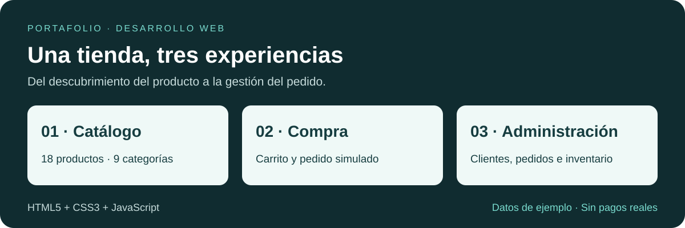
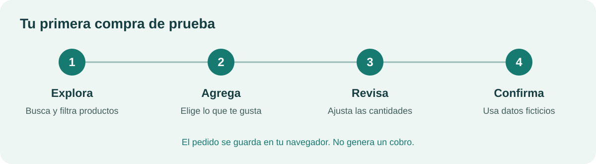

# Sazu Accesorios

### [🌐 Abrir la tienda →](https://ellmoi.github.io/sazu-accesorios/)

Tienda de demostración para comprar al detal y al por mayor. Un proyecto de portafolio que convierte un catálogo en una experiencia de compra clara y organizada.



## Qué demuestra

- **Diseño adaptable:** páginas para computador y celular.
- **JavaScript sin frameworks:** búsqueda, filtros, carrito y formularios.
- **Lógica comercial:** precios al detal y mayoristas, cantidades y disponibilidad.
- **Código organizado:** archivos separados para productos, clientes, pedidos e impresión.

## Qué puedes explorar

| Área | Funciones |
| --- | --- |
| Catálogo | 18 productos en 9 categorías; búsqueda y filtros por precio y disponibilidad. |
| Compra | Detalle del producto, carrito editable y pedido simulado por pasos. |
| Administración | 8 clientes y 10 pedidos de ejemplo; inventario, 7 estados de pedido e impresión. |

## Prueba la tienda en 2 minutos



1. Abre la tienda y baja a **Productos destacados**. Busca un producto o elige una categoría.
2. Pulsa **Ver** para consultar sus detalles y **Agregar** para llevarlo al carrito.
3. Abre el carrito, ajusta las cantidades y pulsa **Finalizar pedido**.
4. Completa los pasos con datos ficticios y pulsa **Confirmar pedido**. No se cobra dinero.

**Precio mayorista:** abre [el carrito completo](https://ellmoi.github.io/sazu-accesorios/carrito.html), selecciona la compra al por mayor y alcanza el mínimo indicado para el producto.

**Administración:** abre [el panel](https://ellmoi.github.io/sazu-accesorios/admin.html) y entra a **Productos**, **Clientes** o **Pedidos**. En pedidos puedes filtrar estados, ver detalles y abrir una orden para imprimir.

## Cómo funciona

**HTML5** organiza las páginas, **CSS3** define su apariencia y **JavaScript** controla las acciones. El carrito, la sesión de demostración y los pedidos nuevos se guardan en `localStorage`: la memoria de ese navegador.

## Ejecución local

Necesitas un navegador moderno con JavaScript y almacenamiento local habilitados. No hay dependencias de ejecución, instalación de paquetes ni compilación. Las fotografías de Unsplash requieren internet.

```sh
git clone https://github.com/ellmoi/sazu-accesorios.git
cd sazu-accesorios
```

Puedes abrir `index.html` directamente para explorar la interfaz. Para compartir de forma consistente el carrito y la sesión entre páginas, utiliza un servidor HTTP local. Si tienes Python 3:

```sh
python -m http.server 8000 --bind 127.0.0.1
```

Abre `http://127.0.0.1:8000/`; el panel está en `/admin.html`. Mantén el mismo navegador, origen y puerto durante la compra. El almacenamiento de páginas abiertas con `file://` depende del navegador.

No se necesitan variables de entorno, claves API ni credenciales. Usa datos ficticios en los formularios.

## Estructura

| Ruta | Responsabilidad |
| --- | --- |
| `*.html` | Catálogo, detalle, carrito, checkout, acceso, perfil y administración. |
| `css/` | Estilos de tienda, administración e impresión. |
| `js/products.js`, `clients.js`, `orders.js` | Datos de ejemplo; productos también define categorías, moneda e inventario. |
| `js/app.js`, `cart.js`, `admin.js`, `print.js` | Interfaz compartida, carrito, panel y documentos imprimibles. |
| `assets/` | Ubicación reservada para imágenes e iconos propios. |
| `docs/` | Reporte del alcance e ilustraciones del README. |
| `scripts/check.mjs` | Verificación estática sin dependencias externas. |
| `.github/` | CI y plantilla de Pull Request. |

Los scripts se cargan con etiquetas HTML y comparten datos mediante `window`; no hay framework, servidor de aplicación ni módulos de backend.

## Desarrollo y verificación

Con Node.js 24, ejecuta `node scripts/check.mjs` y `git diff --check`. Se comprueban sintaxis JavaScript y referencias locales estáticas; no hay suite de pruebas funcionales, linter ni build configurados.

Trabajamos con `main` y ramas cortas por tarea, Pull Requests y Conventional Commits en inglés. Consulta [el flujo de trabajo](CONTRIBUTING.md).

## Alcance real

Es un **prototipo de interfaz**, sin servidor ni base de datos compartida. El acceso y los pagos son simulados. Algunas acciones administrativas solo muestran mensajes o cambios temporales. Los pedidos nuevos no se integran al panel ni al historial del perfil.

El detalle del catálogo se muestra en un modal; `producto.html` es una ficha fija de ejemplo. El panel es público y no aplica autenticación ni permisos. Consulta las limitaciones comerciales conocidas en el reporte antes de reutilizar la lógica para una tienda real.

**Siguiente etapa:** conectar una base de datos, implementar acceso seguro y unificar pedidos, inventario y pagos.

[Ver el reporte breve del proyecto](docs/REPORTE.md)
